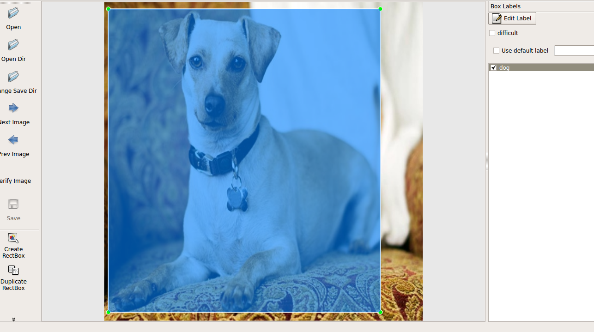

# Custom Object Detector
The project is used to train a custom object detector for identifying cats and  dogs. The results of the model is as shown below:

 

###Training the Model
The steps for training a custom object detector are:
1. Preparing the training data
2. Resizing the images
3. Split the images to test and train data
4. Label the images
5. Train the model in Google Colab

#### Prepare the training data
Add the training data to `./data/raw_images/` folder. It is recommended to use jpg images.

#### Resize the images
The training images should have unique names and equal sizes. You can use `./resize_images.py` for resizing the images. The resized images will be saved in `./data/resized_images/` folder.

#### Split the images to test and train data
Split the images in the resized images directory into test and train data. You can use 80 percent of the images as train data and the rest as test data. Add the training images to `./data/train/` and test images to `./data/test/`

#### Label images
You can use https://tzutalin.github.io/labelImg/ for labelling images. The process for labelling the images are:

* Add the name of objects that you want to train in `labelling_tool/data/predefined_classes.txt`
* Open the labeling tool by clicking `labelling_tool/labelImg`.
* Open `data/train` and `data/test` folders in the tool, mark the objects and save the xml files in the corresponding folders.

#### Train the model
Open `object_detector_training.ipynb` in Google Colab and choose Python 3 runtime with GPU support. 

